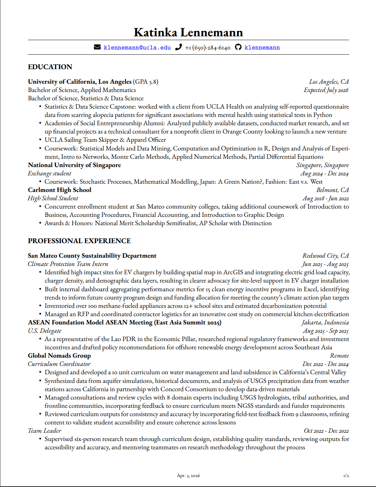
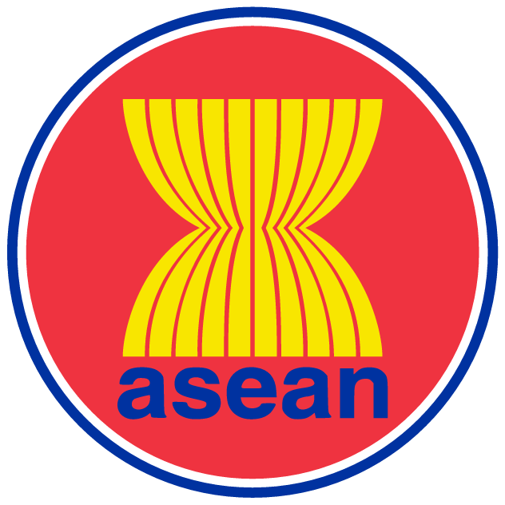
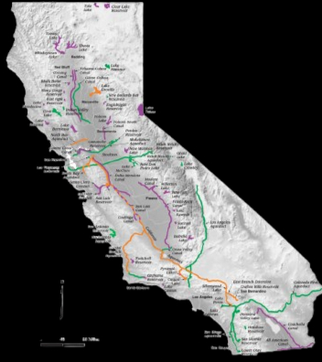
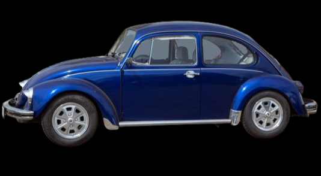

:::: {.columns}
::: {.column width="22%"}
{.headshot}
:::

::: {.column width="22%"}

:::

::::

KATINKA LENNEMANN

Working on building electrification and clean energy in San Mateo County (who knew HVAC technology could be fun!) A geek on systems change and diffusion of innovation. Check out my CV above; click on the icons below to explore my projects. 

  
  
  
  

